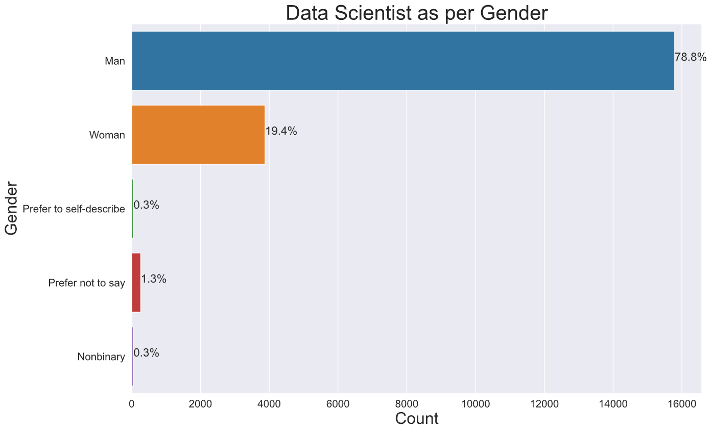
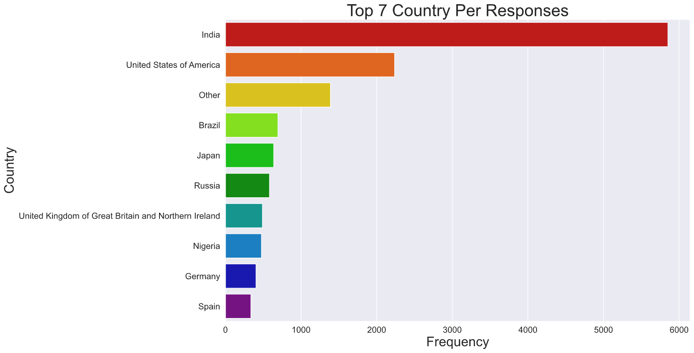
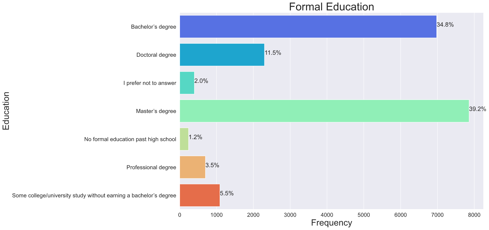
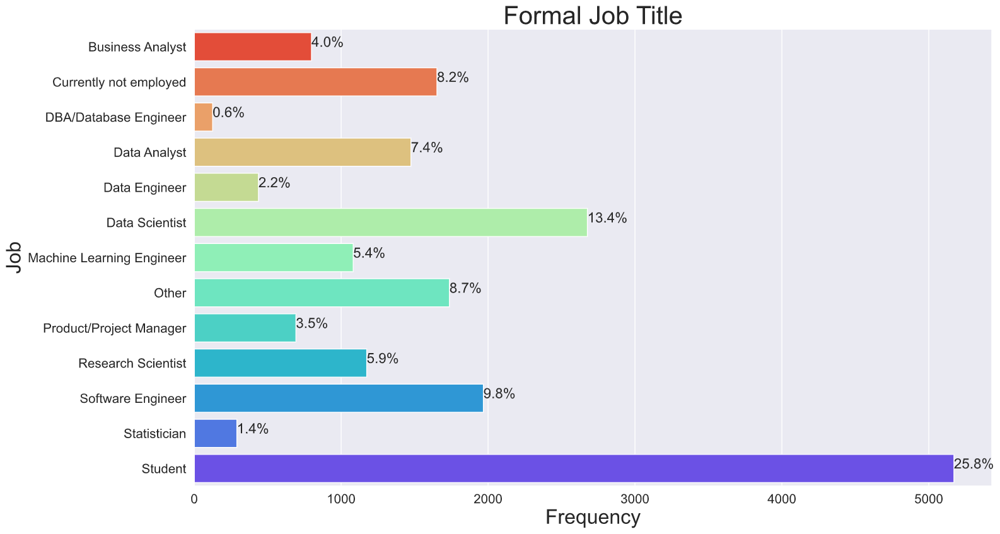
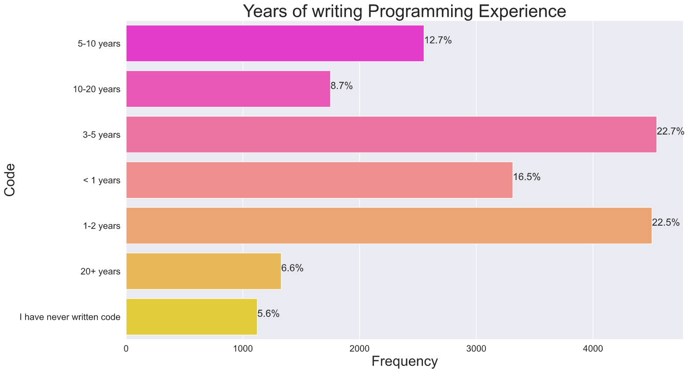
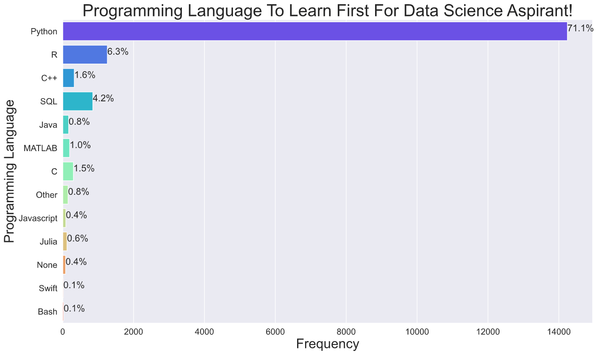

# ***Kaggle-ML-DS-Survey***

**Description**

This year Kaggle is once again launching an annual Data Science Survey Challenge, where we will be awarding a prize pool of $30,000 to notebook authors who tell a rich story about a subset of the data science and machine learning community.

In our fourth year running this survey, we were once again awed by the global, diverse, and dynamic nature of the data science and machine learning industry. This survey data EDA provides an overview of the industry on an aggregate scale, but it also leaves us wanting to know more about the many specific communities comprised within the survey. For that reason, we’re inviting the Kaggle community to dive deep into the survey datasets and help us tell the diverse stories of data scientists from around the world.

  

# ***Visualization***

#### **Question 1: Age Distribution**

 

#### **Question 2: Gender**

 

#### **Question 3: Top 7 Country Responses**

 

#### **Question 4: Highest Level Of Education**

 

#### **Question 5: Job Title**

 

#### **Question 6: How Many Years You are writing Code 👩‍💻👨‍💻**

 

#### **Question 8: What programming language would you recommend an aspiring data scientist to learn first?**

