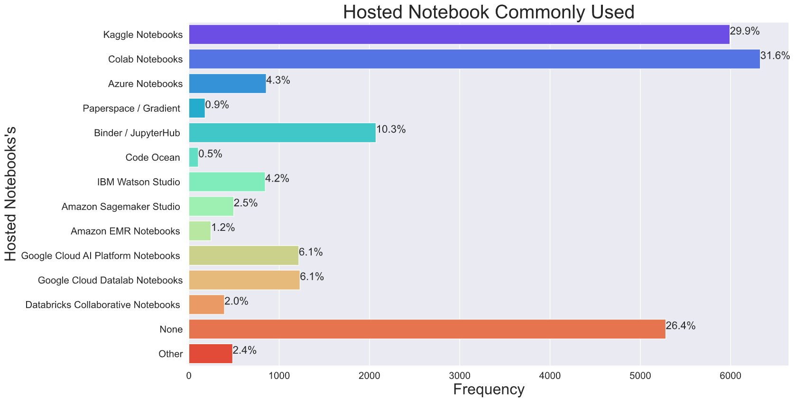

# ***Kaggle-ML-DS-Survey***

**Description**

This year Kaggle is once again launching an annual Data Science Survey Challenge, where we will be awarding a prize pool of $30,000 to notebook authors who tell a rich story about a subset of the data science and machine learning community.

In our fourth year running this survey, we were once again awed by the global, diverse, and dynamic nature of the data science and machine learning industry. This survey data EDA provides an overview of the industry on an aggregate scale, but it also leaves us wanting to know more about the many specific communities comprised within the survey. For that reason, we’re inviting the Kaggle community to dive deep into the survey datasets and help us tell the diverse stories of data scientists from around the world.

  

# ***Visualization***

#### **Question 1: Age Distribution**

 

#### **Question 2: Gender**

 

#### **Question 3: Country **Responses****

 

#### **Question 4: Highest Level Of Education**

 

#### **Question 5: Job Title**

 

#### **Question 6: How Many Years You are writing Code 👩‍💻👨‍💻**

 

#### **Question 7: What programming languages do you use on a regular basis?**

 

#### **Question 8: What programming language would you recommend an aspiring data scientist to learn first?**

 

#### **Question 9: Which of the following integrated development environments (IDE's) do you use on a regular basis?**

 

#### **Question 10: Which of the following hosted notebook products do you use on a regular basis?**

 

#### **Question 11: What type of computing platform do you use most often for your data science projects?**

 

#### **Question 12: What type of computing platform do you use most often for your data science projects?**

 

#### **Question 13: Approximately how many times have you used a TPU (tensor processing unit)?**

 

#### **Question 14: What data visualization libraries or tools do you use on a regular basis?**

 

#### **Question 15: For how many years have you used machine learning methods?**

 

#### **Question 16: Which of the following machine learning frameworks do you use on a regular basis?**

 

#### **Question 17: Which of the following ML algorithms do you use on a regular basis?**

 

#### **Question 18: Which categories of computer vision methods do you use on a regular basis?**

 

#### **Question 19: Which of the following natural language processing (NLP) methods do you use on a regular basis?**

 

#### **Question 20: What is the size of the company where you are employed?**

 

#### **Question 21: Approximately how many individuals are responsible for data science workloads at your place of business?**

 

#### **Question 22: Does your current employer incorporate machine learning methods into their business?**

 

#### **Question 23: Select any activities that make up an important part of your role at work**

 

#### **Question 24: What is your current yearly compensation (approximate $USD)?**

 

#### **Question 25: Approximately how much money have you (or your team) spent on machine learning and/or cloud computing services at home (or at work) in the past 5 years (approximate $USD)?**

 

#### **Question 26 Part-A: Which of the following cloud computing platforms do you use on a regular basis?**

 

#### **Question 26 Part-B: Which of the following cloud computing platforms do you use on a regular basis?**

 

